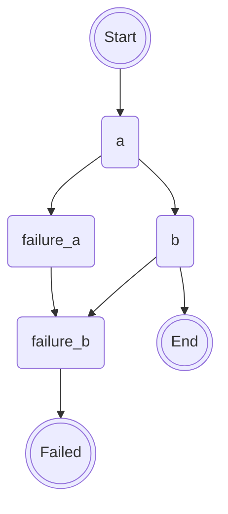

# testingmermaid

```mermaid
flowchart TB
  N0((("Start"))) --> N1("a")
  N1("a") --> N3("b")
  N1("a") --> N2("failure_a")
  N2("failure_a") --> N4("failure_b")
  N3("b") --> N5((("End")))
  N3("b") --> N4("failure_b")
  N4("failure_b") --> N8((("Failed")))
```
